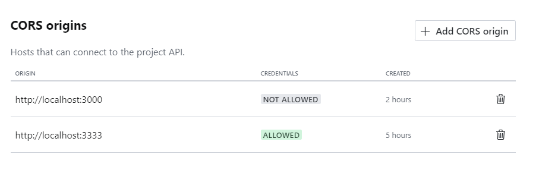

# Instructions

The Content is published in vercel: [Website](https://i-love-vuejs.vercel.app/)

## Clone this project

Clone the project by running `gh repo clone BroJenuel/i-love-vue`

## install dependencies

`yarn install` To install nuxt dependencies

## Sanity

You must create your own sanity project by running `npm -y create sanity@latest`, use `default dataset configuration`, choose `Clean project with no predefined schema types`, and then choose `typescript`. You can then copy the schema types of sanity on this project in `./sanity/schemaTypes`. Then Run It by running `yarn dev`.

After creating your sanity project, go to sanity website under your project.

```
https://www.sanity.io/manage/personal/project/<sanity project id>/api
```

And add CORS origins to avoid cors origin error:


Then in the root folder add your sanity project id to `.env` file (check `.env.example` for the property name).

## How to use Admin To Change Contents
I have created a video on how to use Admin To Change Contents.
